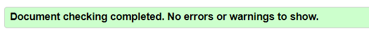
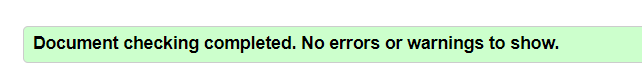

# Calculator

This website is a simple implementation of the Calculator with basic arithmetic operations: +, -, \*, /, %.

The main purpose of this site is demonstrate coding skills in JavaScript, HTML and CSS.

This website is implemented only for education purpose.

## Features

The calculator can do basic arithmetic operation, +, -, \*, /, %. Each operator works according mathematics rules except %.
The operator % conduct remainder of the division.

For example:

5 % 4 = 1

5 % 3 = 2

5 % 2 = 1

Calculations are carried out taking into account the priority of operators which is accepted in mathematics.

For example:

1 + 2 \* 3 = 7

## Testing

-   I tested that this page works in different browsers: Chrome, Firefox, Safari.
-   I confirmed that this project is responsive, looks good and functions оп ап standard screen sizes using the
    devtools device toolbar.

### Validator Testing

-   HTML
    -   No errors were returned when passing through the official W3C validator.

-   CSS
    -   No errors were found when passing through the official (Jigsaw) validator.

-   JSHint

    -   No errors were found when passing through the JSHint validator according with settings in .jshintrc file.

-   Accessibility
    -   I confirm that the colors and fonts chosen are easy to read and accessible by running it through lighthouse in devtools.

## Deployment

-   The site was deployed to GitHub pages. The steps to deploy are as follows:
    -   In the GitHub repository, navigate to the Settings tab
    -   From the source section drop-down menu, select the main branch
    -   Once the main branch has been selected, the page will be automatically refreshed with a detailed ribbon display to indicate the successful deployment.

The live link can be found [here](https://svdotsenko.github.io/portfolio-project-2)
